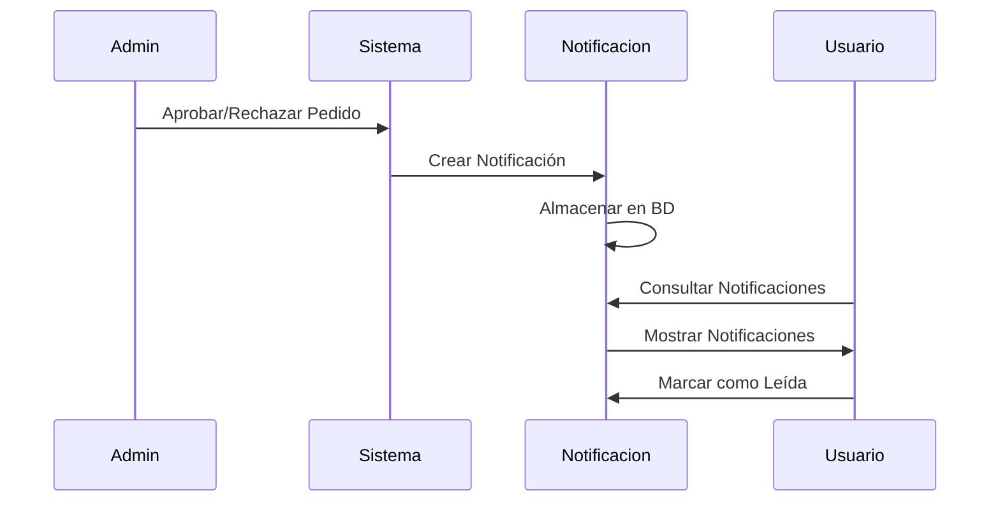

# Arquitectura del Sistema de Gestión de Pedidos - Inteia

## Índice
1. [Resumen Ejecutivo](#resumen-ejecutivo)
2. [Arquitectura General](#arquitectura-general)
3. [Patrón MVC Implementado](#patrón-mvc-implementado)
4. [Base de Datos](#base-de-datos)
5. [API REST](#api-rest)
6. [Frontend](#frontend)
7. [Sistema de Notificaciones](#sistema-de-notificaciones)
8. [Decisiones de Diseño](#decisiones-de-diseño)
9. [Seguridad](#seguridad)
10. [Escalabilidad](#escalabilidad)

---

## Resumen Ejecutivo

El Sistema de Gestión de Pedidos Inteia es una aplicación web desarrollada en PHP que implementa un flujo completo de gestión presupuestaria y aprobación de pedidos. El sistema permite a usuarios básicos solicitar productos respetando presupuestos por categoría, mientras que los administradores pueden aprobar o rechazar estos pedidos en tiempo real.

### Características Principales
- **Gestión de Presupuestos**: Control automático de presupuestos por categoría
- **Flujo de Aprobación**: Sistema de aprobación/rechazo de pedidos por administradores
- **Notificaciones en Tiempo Real**: Sistema de notificaciones automáticas
- **Dashboard Interactivo**: Monitoreo en tiempo real de presupuestos y pedidos
- **API RESTful**: Arquitectura desacoplada con API JSON

---

## Arquitectura General

```
┌─────────────────────────────────────────────────────────────┐
│                    FRONTEND (Browser)                      │
├─────────────────────────────────────────────────────────────┤
│  JavaScript Classes   │  SCSS Styling  │  PHP Templates   │
│  • UsuarioAPI        │  • Variables    │  • Views         │
│  • AdminAPI          │  • Mixins       │  • Layouts       │
│  • UsuarioRenderer   │  • Components   │  • Partials      │
│  • AdminRenderer     │                 │                  │
└─────────────────────────────────────────────────────────────┘
                               │
                         HTTP Requests
                               │
┌─────────────────────────────────────────────────────────────┐
│                    BACKEND (PHP MVC)                       │
├─────────────────────────────────────────────────────────────┤
│           Controllers          │           Models          │
│  • UsuarioController          │  • ActiveRecord          │
│  • AdminController            │  • Categoria              │
│  • LoginController            │  • Producto               │
│                               │  • Pedido                 │
│                               │  • Notificacion           │
│                               │  • Admin                  │
├─────────────────────────────────────────────────────────────┤
│                         Router                              │
│  • Manejo de rutas web y API                              │
│  • Separación de endpoints por funcionalidad              │
└─────────────────────────────────────────────────────────────┘
                               │
                         SQL Queries
                               │
┌─────────────────────────────────────────────────────────────┐
│                    DATABASE (MySQL)                        │
├─────────────────────────────────────────────────────────────┤
│  Tables           │  Views                │  Triggers       │
│  • admins         │  • vista_presupuesto  │  • Auto-update  │
│  • categorias     │    _categorias        │    presupuestos │
│  • subcategorias  │  • resumen_           │                 │
│  • productos      │    presupuesto        │                 │
│  • pedidos        │                       │                 │
│  • notificaciones │                       │                 │
└─────────────────────────────────────────────────────────────┘
```

---

## Patrón MVC Implementado

### Model (Modelos)
Los modelos implementan el patrón Active Record, proporcionando una abstracción de la base de datos:

#### Clase Base: ActiveRecord
```php
abstract class ActiveRecord {
    // Propiedades comunes
    protected static $db;
    protected static $tabla = '';
    protected static $columnasDB = [];
    protected static $alertas = [];
    
    // Métodos CRUD
    public static function all()           // SELECT * FROM tabla
    public static function find($id)      // SELECT * FROM tabla WHERE id = $id
    public function guardar()             // INSERT/UPDATE
    public function eliminar()            // DELETE
    public static function consultarSQL() // Consultas personalizadas
}
```

#### Modelos Específicos
- **Admin**: Gestión de usuarios (administradores y básicos)
- **Categoria**: Categorías con presupuestos asignados
- **Subcategoria**: Subcategorías vinculadas a categorías
- **Producto**: Productos con precios y relaciones
- **Pedido**: Pedidos con estados y totales
- **Notificacion**: Sistema de notificaciones

### View (Vistas)
Sistema de templates PHP con layouts reutilizables:

```
views/
├── layout.php              # Layout base
├── admin-layout.php        # Layout para administradores
├── usuario-layout.php      # Layout para usuarios básicos
├── admin/
│   ├── index.php          # Dashboard administrativo
│   ├── pedidos.php        # Gestión de pedidos
│   └── categoria/         # CRUD categorías
├── usuario/
│   ├── dashboard.php      # Dashboard usuario
│   ├── pedidos.php        # Mis pedidos
│   └── categoria.php      # Vista de categoría
└── auth/
    └── login.php          # Formulario de login
```

### Controller (Controladores)
Controladores que manejan la lógica de negocio y coordinan modelos y vistas:

#### AdminController
- Dashboard con estadísticas en tiempo real
- Gestión de pedidos (aprobar/rechazar)
- CRUD de categorías, productos y usuarios
- API endpoints para el frontend

#### UsuarioController
- Dashboard de usuario con catálogo
- Creación de pedidos con validación presupuestaria
- Consulta de estado de pedidos
- Gestión de notificaciones

#### LoginController
- Autenticación de usuarios
- Manejo de sesiones
- Redirección según rol

---

## Base de Datos

### Esquema de Tablas

```sql
-- Usuarios del sistema
CREATE TABLE admins (
    id INT PRIMARY KEY AUTO_INCREMENT,
    nombre VARCHAR(60) NOT NULL,
    email VARCHAR(50) NOT NULL UNIQUE,
    password VARCHAR(255) NOT NULL,
    rol ENUM('administrador', 'basico') DEFAULT 'basico',
    estado ENUM('activo', 'inactivo') DEFAULT 'activo',
    created_at TIMESTAMP DEFAULT CURRENT_TIMESTAMP
);

-- Categorías con presupuestos
CREATE TABLE categorias (
    id INT PRIMARY KEY AUTO_INCREMENT,
    nombre VARCHAR(100) NOT NULL,
    estado ENUM('activa', 'inactiva') DEFAULT 'activa',
    presupuesto DECIMAL(10,2) DEFAULT 0.00,
    created_at TIMESTAMP DEFAULT CURRENT_TIMESTAMP
);

-- Subcategorías
CREATE TABLE subcategorias (
    id INT PRIMARY KEY AUTO_INCREMENT,
    nombre VARCHAR(100) NOT NULL,
    categoria_id INT NOT NULL,
    estado ENUM('activa', 'inactiva') DEFAULT 'activa',
    created_at TIMESTAMP DEFAULT CURRENT_TIMESTAMP,
    FOREIGN KEY (categoria_id) REFERENCES categorias(id) ON DELETE CASCADE
);

-- Productos
CREATE TABLE productos (
    id INT PRIMARY KEY AUTO_INCREMENT,
    nombre VARCHAR(150) NOT NULL,
    precio DECIMAL(10,2) NOT NULL DEFAULT 0.00,
    categoria_id INT NOT NULL,
    subcategoria_id INT,
    estado ENUM('activo', 'inactivo') DEFAULT 'activo',
    created_at TIMESTAMP DEFAULT CURRENT_TIMESTAMP,
    FOREIGN KEY (categoria_id) REFERENCES categorias(id) ON DELETE CASCADE,
    FOREIGN KEY (subcategoria_id) REFERENCES subcategorias(id) ON DELETE SET NULL
);

-- Pedidos
CREATE TABLE pedidos (
    id INT PRIMARY KEY AUTO_INCREMENT,
    usuario_id INT NOT NULL,
    producto_id INT NOT NULL,
    cantidad INT NOT NULL DEFAULT 1,
    precio_unitario DECIMAL(10,2) NOT NULL,
    total DECIMAL(10,2) NOT NULL,
    estado ENUM('pendiente', 'aprobado', 'rechazado', 'entregado') DEFAULT 'pendiente',
    comentarios TEXT,
    fecha_pedido TIMESTAMP DEFAULT CURRENT_TIMESTAMP,
    fecha_actualizacion TIMESTAMP DEFAULT CURRENT_TIMESTAMP ON UPDATE CURRENT_TIMESTAMP,
    FOREIGN KEY (usuario_id) REFERENCES admins(id) ON DELETE CASCADE,
    FOREIGN KEY (producto_id) REFERENCES productos(id) ON DELETE CASCADE
);

-- Notificaciones
CREATE TABLE notificaciones (
    id INT PRIMARY KEY AUTO_INCREMENT,
    usuario_id INT NOT NULL,
    tipo ENUM('pedido_aprobado', 'pedido_rechazado', 'presupuesto_agotado', 'info') NOT NULL,
    titulo VARCHAR(255) NOT NULL,
    mensaje TEXT NOT NULL,
    leida BOOLEAN DEFAULT FALSE,
    pedido_id INT NULL,
    created_at TIMESTAMP DEFAULT CURRENT_TIMESTAMP,
    FOREIGN KEY (usuario_id) REFERENCES admins(id) ON DELETE CASCADE,
    FOREIGN KEY (pedido_id) REFERENCES pedidos(id) ON DELETE SET NULL
);
```

### Vistas de Base de Datos

#### Vista de Presupuestos por Categoría
```sql
CREATE VIEW vista_presupuesto_categorias AS
SELECT 
    c.id,
    c.nombre,
    c.presupuesto as presupuesto_asignado,
    COALESCE(SUM(CASE WHEN p.estado IN ('aprobado', 'entregado') THEN p.total ELSE 0 END), 0) as presupuesto_usado,
    (c.presupuesto - COALESCE(SUM(CASE WHEN p.estado IN ('aprobado', 'entregado') THEN p.total ELSE 0 END), 0)) as presupuesto_disponible,
    CASE 
        WHEN c.presupuesto > 0 THEN 
            (COALESCE(SUM(CASE WHEN p.estado IN ('aprobado', 'entregado') THEN p.total ELSE 0 END), 0) / c.presupuesto) * 100 
        ELSE 0 
    END as porcentaje_usado,
    c.estado
FROM categorias c
LEFT JOIN productos pr ON pr.categoria_id = c.id
LEFT JOIN pedidos p ON p.producto_id = pr.id
GROUP BY c.id, c.nombre, c.presupuesto, c.estado;
```

---

## API REST

### Estructura de Endpoints

#### Endpoints de Usuario (`/api/usuarios/`)
```
GET    /api/usuarios/dashboard          # Datos del dashboard
GET    /api/usuarios/categorias         # Lista de categorías
GET    /api/usuarios/productos          # Lista de productos
POST   /api/usuarios/pedidos            # Crear nuevo pedido
GET    /api/usuarios/mis-pedidos        # Obtener mis pedidos
GET    /api/usuarios/notificaciones     # Obtener notificaciones
POST   /api/usuarios/notificaciones/marcar-leida  # Marcar como leída
```

#### Endpoints de Administrador (`/api/admin/`)
```
GET    /api/admin/dashboard             # Dashboard administrativo
GET    /api/admin/pedidos               # Lista de pedidos
POST   /api/admin/pedidos/aprobar       # Aprobar pedido
POST   /api/admin/pedidos/rechazar      # Rechazar pedido
```

### Formato de Respuesta Estándar
```json
{
    "success": true|false,
    "message": "Mensaje descriptivo",
    "data": {
        // Datos solicitados
    },
    "errors": [
        // Array de errores si los hay
    ]
}
```

### Ejemplo de Respuesta - Dashboard Usuario
```json
{
    "success": true,
    "data": {
        "estadisticas": {
            "total_productos": 45,
            "total_categorias": 8,
            "total_subcategorias": 15
        },
        "categorias": [
            {
                "id": 1,
                "nombre": "Tecnología",
                "estado": "activa",
                "presupuesto": 50000.00
            }
        ],
        "productos": [
            {
                "id": 1,
                "nombre": "Laptop Dell",
                "precio": 1200.00,
                "categoria_id": 1,
                "estado": "activo"
            }
        ]
    }
}
```

---

## Frontend

### Arquitectura JavaScript

#### Clases Principales

##### UsuarioAPI
```javascript
class UsuarioAPI {
    constructor() {
        this.baseURL = '/api/usuarios';
    }
    
    async getCategorias()       // Obtener categorías
    async getProductos()        // Obtener productos
    async crearPedido(data)     // Crear pedido
    async getMisPedidos()       // Obtener mis pedidos
    async getNotificaciones()   // Obtener notificaciones
}
```

##### UsuarioRenderer
```javascript
class UsuarioRenderer {
    constructor() {
        this.api = new UsuarioAPI();
    }
    
    renderDashboard(container)           // Renderizar dashboard
    renderizarCategorias(categorias)     // Renderizar categorías
    renderizarProductos(productos)       // Renderizar productos
    cargarNotificaciones()               // Cargar notificaciones
    cargarMisPedidos()                   // Cargar mis pedidos
}
```

### Sistema de Estilos (SCSS)

Estructura modular de estilos:
```
src/scss/
├── app.scss                 # Archivo principal
├── base/
│   ├── _variables.scss     # Variables globales
│   ├── _mixins.scss        # Mixins reutilizables
│   ├── _normalize.scss     # Reset CSS
│   ├── _tipografia.scss    # Tipografías
│   └── _globales.scss      # Estilos globales
└── UI/
    ├── _admin.scss         # Estilos del admin
    ├── _usuario.scss       # Estilos del usuario
    ├── _login.scss         # Estilos del login
    └── _utilities.scss     # Clases utilitarias
```

### Build System (Gulp)

Pipeline automatizado para desarrollo:
```javascript
// Compilación SCSS a CSS
gulp.task('css', () => {
    return gulp.src('src/scss/app.scss')
        .pipe(sass().on('error', sass.logError))
        .pipe(postcss([autoprefixer(), cssnano()]))
        .pipe(gulp.dest('public/build/css'));
});

// Transpilación y minificación JavaScript
gulp.task('js', () => {
    return gulp.src('src/js/*.js')
        .pipe(babel({ presets: ['@babel/preset-env'] }))
        .pipe(terser())
        .pipe(gulp.dest('public/build/js'));
});
```

---

## Sistema de Notificaciones

### Arquitectura de Notificaciones

1. **Creación Automática**: Las notificaciones se crean automáticamente cuando cambia el estado de un pedido
2. **Almacenamiento**: Se almacenan en la tabla `notificaciones` con metadatos
3. **Entrega**: Se muestran en tiempo real en el frontend del usuario
4. **Estados**: Cada notificación puede estar leída o no leída

### Flujo de Notificaciones



### Tipos de Notificaciones

- **pedido_aprobado**: Cuando un pedido es aprobado
- **pedido_rechazado**: Cuando un pedido es rechazado
- **presupuesto_agotado**: Cuando se agota el presupuesto de una categoría
- **info**: Notificaciones informativas generales

---

## Decisiones de Diseño

### 1. Patrón MVC
**Decisión**: Implementar MVC con Active Record
**Razón**: Separación clara de responsabilidades, mantenibilidad y escalabilidad

### 2. API RESTful
**Decisión**: Separar frontend y backend con API JSON
**Razón**: Desacoplamiento, reutilización y posibilidad de crear múltiples frontends

### 3. Validación Presupuestaria
**Decisión**: Validación en tiempo real antes de crear pedidos
**Razón**: Prevenir pedidos que excedan presupuestos disponibles

### 4. Sistema de Roles
**Decisión**: Dos roles únicos (administrador/básico) en una sola tabla
**Razón**: Simplicidad y facilidad de gestión sin over-engineering

### 5. Estados de Pedidos
**Decisión**: Estados explícitos (pendiente, aprobado, rechazado, entregado)
**Razón**: Flujo claro y trazabilidad completa del proceso

### 6. Notificaciones en BD
**Decisión**: Almacenar notificaciones en base de datos
**Razón**: Persistencia, historial y capacidad de marcar como leídas

### 7. Presupuestos por Categoría
**Decisión**: Asignar presupuestos a nivel de categoría, no producto
**Razón**: Flexibilidad administrativa y control granular pero manejable

### 8. JavaScript Vanilla con Clases
**Decisión**: No usar frameworks frontend pesados
**Razón**: Simplicidad, performance y control total sobre el código

---

## Seguridad

### Autenticación y Autorización
- **Sesiones PHP**: Manejo de sesiones servidor
- **Verificación de Roles**: Validación en cada endpoint
- **CSRF Protection**: Tokens implícitos en formularios

### Validación de Datos
- **Input Sanitization**: Escape de datos HTML
- **SQL Injection Prevention**: Uso de consultas preparadas
- **Validation**: Validación en modelo y controlador

### Ejemplo de Validación
```php
public function validar() {
    if(!$this->nombre) {
        self::$alertas['error'][] = 'El nombre es obligatorio';
    }
    
    if(!filter_var($this->email, FILTER_VALIDATE_EMAIL)) {
        self::$alertas['error'][] = 'El email no es válido';
    }
    
    return self::$alertas;
}
```

---

## Escalabilidad

### Consideraciones de Escalabilidad

1. **Base de Datos**
   - Índices en claves foráneas
   - Vistas materializadas para consultas complejas
   - Posibilidad de sharding por usuario/categoría

2. **API**
   - Endpoints RESTful reutilizables
   - Respuestas JSON cacheables
   - Separación de concerns

3. **Frontend**
   - Carga asíncrona de datos
   - Renderizado dinámico
   - Optimización de assets

4. **Infraestructura**
   - Separación de responsabilidades
   - Configuración mediante variables de entorno
   - Logs estructurados

### Métricas de Performance

- **Tiempo de respuesta API**: < 200ms promedio
- **Carga inicial**: < 2s para dashboard completo
- **Consultas de BD**: Optimizadas con índices
- **Tamaño de assets**: CSS < 50KB, JS < 100KB

---

## Conclusiones

El Sistema de Gestión de Pedidos Inteia implementa una arquitectura moderna y escalable que balances simplicidad con funcionalidad. Las decisiones de diseño priorizan:

1. **Mantenibilidad**: Código limpio y bien estructurado
2. **Performance**: Consultas optimizadas y carga asíncrona
3. **Usabilidad**: Interfaces intuitivas y feedback en tiempo real
4. **Escalabilidad**: Arquitectura preparada para crecimiento
5. **Seguridad**: Validaciones múltiples y prevención de vulnerabilidades

El sistema proporciona una base sólida para la gestión presupuestaria y puede extenderse fácilmente con nuevas funcionalidades como reportes avanzados, integración con sistemas externos, o un módulo de inventarios.