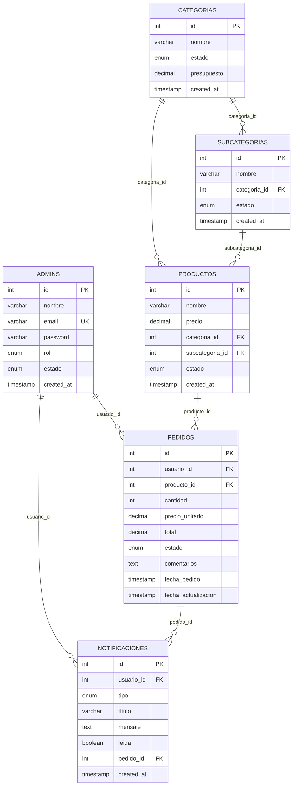

# Esquema de Base de Datos - Sistema Inteia

## Índice
1. [Diagrama de Relaciones](#diagrama-de-relaciones)
2. [Descripción de Tablas](#descripción-de-tablas)
3. [Relaciones y Claves Foráneas](#relaciones-y-claves-foráneas)
4. [Vistas Materializadas](#vistas-materializadas)
5. [Índices](#índices)
6. [Triggers y Procedures](#triggers-y-procedures)
7. [Consultas Importantes](#consultas-importantes)

---

## Diagrama de Relaciones



---

## Descripción de Tablas

### 1. ADMINS
**Propósito**: Almacena información de todos los usuarios del sistema (administradores y usuarios básicos)

```sql
CREATE TABLE admins (
    id INT PRIMARY KEY AUTO_INCREMENT,
    nombre VARCHAR(60) NOT NULL,
    email VARCHAR(50) NOT NULL UNIQUE,
    password VARCHAR(255) NOT NULL,
    rol ENUM('administrador', 'basico') DEFAULT 'basico',
    estado ENUM('activo', 'inactivo') DEFAULT 'activo',
    created_at TIMESTAMP DEFAULT CURRENT_TIMESTAMP
);
```

**Campos Importantes:**
- `rol`: Determina los permisos del usuario
- `estado`: Permite activar/desactivar usuarios
- `password`: Almacenado con hash seguro (bcrypt)

**Datos de Ejemplo:**
```sql
INSERT INTO admins (nombre, email, password, rol, estado) VALUES
('Juan Administrador', 'admin@inteia.com', '$2y$10$hash...', 'administrador', 'activo'),
('María Usuario', 'maria@inteia.com', '$2y$10$hash...', 'basico', 'activo'),
('Carlos Pérez', 'carlos@inteia.com', '$2y$10$hash...', 'basico', 'activo');
```

### 2. CATEGORIAS
**Propósito**: Define las categorías de productos con sus presupuestos asignados

```sql
CREATE TABLE categorias (
    id INT PRIMARY KEY AUTO_INCREMENT,
    nombre VARCHAR(100) NOT NULL,
    estado ENUM('activa', 'inactiva') DEFAULT 'activa',
    presupuesto DECIMAL(10,2) DEFAULT 0.00,
    created_at TIMESTAMP DEFAULT CURRENT_TIMESTAMP
);
```

**Campos Importantes:**
- `presupuesto`: Monto asignado para toda la categoría
- `estado`: Permite activar/desactivar categorías completas

**Datos de Ejemplo:**
```sql
INSERT INTO categorias (nombre, presupuesto, estado) VALUES
('Tecnología', 50000.00, 'activa'),
('Oficina', 30000.00, 'activa'),
('Marketing', 20000.00, 'activa'),
('Recursos Humanos', 15000.00, 'activa');
```

### 3. SUBCATEGORIAS
**Propósito**: Subdivide las categorías para mayor organización

```sql
CREATE TABLE subcategorias (
    id INT PRIMARY KEY AUTO_INCREMENT,
    nombre VARCHAR(100) NOT NULL,
    categoria_id INT NOT NULL,
    estado ENUM('activa', 'inactiva') DEFAULT 'activa',
    created_at TIMESTAMP DEFAULT CURRENT_TIMESTAMP,
    FOREIGN KEY (categoria_id) REFERENCES categorias(id) ON DELETE CASCADE
);
```

**Datos de Ejemplo:**
```sql
INSERT INTO subcategorias (nombre, categoria_id, estado) VALUES
('Computadoras', 1, 'activa'),
('Periféricos', 1, 'activa'),
('Software', 1, 'activa'),
('Mobiliario', 2, 'activa'),
('Papelería', 2, 'activa');
```

### 4. PRODUCTOS
**Propósito**: Catálogo completo de productos disponibles para pedidos

```sql
CREATE TABLE productos (
    id INT PRIMARY KEY AUTO_INCREMENT,
    nombre VARCHAR(150) NOT NULL,
    precio DECIMAL(10,2) NOT NULL DEFAULT 0.00,
    categoria_id INT NOT NULL,
    subcategoria_id INT,
    estado ENUM('activo', 'inactivo') DEFAULT 'activo',
    created_at TIMESTAMP DEFAULT CURRENT_TIMESTAMP,
    FOREIGN KEY (categoria_id) REFERENCES categorias(id) ON DELETE CASCADE,
    FOREIGN KEY (subcategoria_id) REFERENCES subcategorias(id) ON DELETE SET NULL
);
```

**Relaciones:**
- Pertenece obligatoriamente a una categoría
- Opcionalmente pertenece a una subcategoría

**Datos de Ejemplo:**
```sql
INSERT INTO productos (nombre, precio, categoria_id, subcategoria_id, estado) VALUES
('Laptop Dell XPS 13', 1200.00, 1, 1, 'activo'),
('Mouse Inalámbrico Logitech', 45.00, 1, 2, 'activo'),
('Teclado Mecánico', 120.00, 1, 2, 'activo'),
('Silla Ergonómica', 350.00, 2, 4, 'activo'),
('Escritorio Regulable', 800.00, 2, 4, 'activo');
```

### 5. PEDIDOS
**Propósito**: Registra todos los pedidos realizados por usuarios

```sql
CREATE TABLE pedidos (
    id INT PRIMARY KEY AUTO_INCREMENT,
    usuario_id INT NOT NULL,
    producto_id INT NOT NULL,
    cantidad INT NOT NULL DEFAULT 1,
    precio_unitario DECIMAL(10,2) NOT NULL,
    total DECIMAL(10,2) NOT NULL,
    estado ENUM('pendiente', 'aprobado', 'rechazado', 'entregado') DEFAULT 'pendiente',
    comentarios TEXT,
    fecha_pedido TIMESTAMP DEFAULT CURRENT_TIMESTAMP,
    fecha_actualizacion TIMESTAMP DEFAULT CURRENT_TIMESTAMP ON UPDATE CURRENT_TIMESTAMP,
    FOREIGN KEY (usuario_id) REFERENCES admins(id) ON DELETE CASCADE,
    FOREIGN KEY (producto_id) REFERENCES productos(id) ON DELETE CASCADE
);
```

**Estados del Pedido:**
- `pendiente`: Recién creado, esperando aprobación
- `aprobado`: Aprobado por administrador
- `rechazado`: Rechazado por administrador
- `entregado`: Producto entregado al usuario

**Datos de Ejemplo:**
```sql
INSERT INTO pedidos (usuario_id, producto_id, cantidad, precio_unitario, total, estado, comentarios) VALUES
(2, 1, 1, 1200.00, 1200.00, 'aprobado', 'Urgente para proyecto nuevo'),
(3, 2, 2, 45.00, 90.00, 'pendiente', NULL),
(2, 4, 1, 350.00, 350.00, 'rechazado', 'Presupuesto agotado este mes');
```

### 6. NOTIFICACIONES
**Propósito**: Sistema de notificaciones para informar a usuarios sobre cambios de estado

```sql
CREATE TABLE notificaciones (
    id INT PRIMARY KEY AUTO_INCREMENT,
    usuario_id INT NOT NULL,
    tipo ENUM('pedido_aprobado', 'pedido_rechazado', 'presupuesto_agotado', 'info') NOT NULL,
    titulo VARCHAR(255) NOT NULL,
    mensaje TEXT NOT NULL,
    leida BOOLEAN DEFAULT FALSE,
    pedido_id INT NULL,
    created_at TIMESTAMP DEFAULT CURRENT_TIMESTAMP,
    FOREIGN KEY (usuario_id) REFERENCES admins(id) ON DELETE CASCADE,
    FOREIGN KEY (pedido_id) REFERENCES pedidos(id) ON DELETE SET NULL
);
```

**Tipos de Notificaciones:**
- `pedido_aprobado`: Cuando un pedido es aprobado
- `pedido_rechazado`: Cuando un pedido es rechazado
- `presupuesto_agotado`: Cuando se agota presupuesto de categoría
- `info`: Notificaciones informativas generales

---

## Relaciones y Claves Foráneas

### Relaciones Principales

```sql
-- Usuario → Pedidos (1:N)
FOREIGN KEY (usuario_id) REFERENCES admins(id) ON DELETE CASCADE

-- Producto → Pedidos (1:N)
FOREIGN KEY (producto_id) REFERENCES productos(id) ON DELETE CASCADE

-- Categoría → Productos (1:N)
FOREIGN KEY (categoria_id) REFERENCES categorias(id) ON DELETE CASCADE

-- Subcategoría → Productos (1:N) [Opcional]
FOREIGN KEY (subcategoria_id) REFERENCES subcategorias(id) ON DELETE SET NULL

-- Categoría → Subcategorías (1:N)
FOREIGN KEY (categoria_id) REFERENCES categorias(id) ON DELETE CASCADE

-- Usuario → Notificaciones (1:N)
FOREIGN KEY (usuario_id) REFERENCES admins(id) ON DELETE CASCADE

-- Pedido → Notificaciones (1:N) [Opcional]
FOREIGN KEY (pedido_id) REFERENCES pedidos(id) ON DELETE SET NULL
```

### Políticas de Eliminación

- **CASCADE**: Elimina registros dependientes automáticamente
- **SET NULL**: Establece NULL en referencias opcionales

---

## Vistas Materializadas

### 1. Vista de Presupuestos por Categoría

```sql
CREATE VIEW vista_presupuesto_categorias AS
SELECT 
    c.id,
    c.nombre,
    c.presupuesto as presupuesto_asignado,
    COALESCE(SUM(CASE WHEN p.estado IN ('aprobado', 'entregado') THEN p.total ELSE 0 END), 0) as presupuesto_usado,
    (c.presupuesto - COALESCE(SUM(CASE WHEN p.estado IN ('aprobado', 'entregado') THEN p.total ELSE 0 END), 0)) as presupuesto_disponible,
    CASE 
        WHEN c.presupuesto > 0 THEN 
            (COALESCE(SUM(CASE WHEN p.estado IN ('aprobado', 'entregado') THEN p.total ELSE 0 END), 0) / c.presupuesto) * 100 
        ELSE 0 
    END as porcentaje_usado,
    c.estado
FROM categorias c
LEFT JOIN productos pr ON pr.categoria_id = c.id
LEFT JOIN pedidos p ON p.producto_id = pr.id
GROUP BY c.id, c.nombre, c.presupuesto, c.estado
ORDER BY c.nombre;
```

**Uso**: Dashboard administrativo para monitoreo en tiempo real de presupuestos

### 2. Vista de Resumen de Presupuestos

```sql
CREATE VIEW resumen_presupuesto AS
SELECT 
    SUM(presupuesto_asignado) as total_asignado,
    SUM(presupuesto_usado) as total_usado,
    SUM(presupuesto_disponible) as total_disponible,
    AVG(porcentaje_usado) as promedio_uso
FROM vista_presupuesto_categorias 
WHERE estado = 'activa';
```

**Uso**: Estadísticas generales del sistema

---

## Índices

### Índices Primarios (Automáticos)
```sql
-- Cada tabla tiene su PRIMARY KEY automáticamente indexada
CREATE INDEX idx_admins_id ON admins(id);
CREATE INDEX idx_categorias_id ON categorias(id);
-- ... etc
```

### Índices de Claves Foráneas
```sql
CREATE INDEX idx_pedidos_usuario_id ON pedidos(usuario_id);
CREATE INDEX idx_pedidos_producto_id ON pedidos(producto_id);
CREATE INDEX idx_productos_categoria_id ON productos(categoria_id);
CREATE INDEX idx_productos_subcategoria_id ON productos(subcategoria_id);
CREATE INDEX idx_subcategorias_categoria_id ON subcategorias(categoria_id);
CREATE INDEX idx_notificaciones_usuario_id ON notificaciones(usuario_id);
CREATE INDEX idx_notificaciones_pedido_id ON notificaciones(pedido_id);
```

### Índices de Rendimiento
```sql
-- Búsquedas por email (login)
CREATE UNIQUE INDEX idx_admins_email ON admins(email);

-- Filtros por estado
CREATE INDEX idx_pedidos_estado ON pedidos(estado);
CREATE INDEX idx_productos_estado ON productos(estado);
CREATE INDEX idx_categorias_estado ON categorias(estado);

-- Ordenamiento por fecha
CREATE INDEX idx_pedidos_fecha ON pedidos(fecha_pedido);
CREATE INDEX idx_notificaciones_fecha ON notificaciones(created_at);

-- Notificaciones no leídas
CREATE INDEX idx_notificaciones_leida ON notificaciones(usuario_id, leida);
```

---

## Triggers y Procedures

### Trigger para Actualización Automática de Fechas

```sql
DELIMITER //
CREATE TRIGGER pedidos_update_timestamp 
    BEFORE UPDATE ON pedidos
    FOR EACH ROW
BEGIN
    SET NEW.fecha_actualizacion = CURRENT_TIMESTAMP;
END//
DELIMITER ;
```

### Procedure para Validación de Presupuesto

```sql
DELIMITER //
CREATE PROCEDURE ValidarPresupuesto(
    IN p_producto_id INT,
    IN p_cantidad INT,
    IN p_precio_unitario DECIMAL(10,2),
    OUT resultado BOOLEAN
)
BEGIN
    DECLARE v_categoria_id INT;
    DECLARE v_presupuesto_total DECIMAL(10,2);
    DECLARE v_presupuesto_usado DECIMAL(10,2);
    DECLARE v_total_pedido DECIMAL(10,2);
    
    -- Calcular total del pedido
    SET v_total_pedido = p_cantidad * p_precio_unitario;
    
    -- Obtener categoría del producto
    SELECT categoria_id INTO v_categoria_id 
    FROM productos 
    WHERE id = p_producto_id;
    
    -- Obtener presupuesto total de la categoría
    SELECT presupuesto INTO v_presupuesto_total 
    FROM categorias 
    WHERE id = v_categoria_id;
    
    -- Calcular presupuesto ya usado
    SELECT COALESCE(SUM(total), 0) INTO v_presupuesto_usado
    FROM pedidos p
    INNER JOIN productos pr ON p.producto_id = pr.id
    WHERE pr.categoria_id = v_categoria_id 
    AND p.estado IN ('aprobado', 'entregado');
    
    -- Verificar si hay presupuesto suficiente
    IF (v_presupuesto_usado + v_total_pedido) <= v_presupuesto_total THEN
        SET resultado = TRUE;
    ELSE
        SET resultado = FALSE;
    END IF;
END//
DELIMITER ;
```

### Function para Calcular Presupuesto Disponible

```sql
DELIMITER //
CREATE FUNCTION PresupuestoDisponible(categoria_id INT) 
RETURNS DECIMAL(10,2)
READS SQL DATA
DETERMINISTIC
BEGIN
    DECLARE presupuesto_total DECIMAL(10,2);
    DECLARE presupuesto_usado DECIMAL(10,2);
    
    SELECT presupuesto INTO presupuesto_total 
    FROM categorias 
    WHERE id = categoria_id;
    
    SELECT COALESCE(SUM(total), 0) INTO presupuesto_usado
    FROM pedidos p
    INNER JOIN productos pr ON p.producto_id = pr.id
    WHERE pr.categoria_id = categoria_id 
    AND p.estado IN ('aprobado', 'entregado');
    
    RETURN presupuesto_total - presupuesto_usado;
END//
DELIMITER ;
```

---

## Consultas Importantes

### 1. Dashboard Administrativo

```sql
-- Estadísticas generales
SELECT 
    (SELECT COUNT(*) FROM productos WHERE estado = 'activo') as total_productos,
    (SELECT COUNT(*) FROM categorias WHERE estado = 'activa') as total_categorias,
    (SELECT COUNT(*) FROM subcategorias WHERE estado = 'activa') as total_subcategorias,
    (SELECT COUNT(*) FROM admins WHERE estado = 'activo') as total_usuarios,
    (SELECT SUM(presupuesto) FROM categorias WHERE estado = 'activa') as presupuesto_total,
    (SELECT COUNT(*) FROM pedidos WHERE estado = 'pendiente') as pedidos_pendientes;
```

### 2. Pedidos con Información Completa

```sql
SELECT 
    p.id,
    p.cantidad,
    p.precio_unitario,
    p.total,
    p.estado,
    p.comentarios,
    p.fecha_pedido,
    u.nombre as usuario_nombre,
    u.email as usuario_email,
    pr.nombre as producto_nombre,
    c.nombre as categoria_nombre,
    s.nombre as subcategoria_nombre
FROM pedidos p
INNER JOIN admins u ON p.usuario_id = u.id
INNER JOIN productos pr ON p.producto_id = pr.id
INNER JOIN categorias c ON pr.categoria_id = c.id
LEFT JOIN subcategorias s ON pr.subcategoria_id = s.id
ORDER BY p.fecha_pedido DESC;
```

### 3. Notificaciones No Leídas por Usuario

```sql
SELECT 
    n.id,
    n.tipo,
    n.titulo,
    n.mensaje,
    n.created_at,
    p.id as pedido_numero
FROM notificaciones n
LEFT JOIN pedidos p ON n.pedido_id = p.id
WHERE n.usuario_id = :usuario_id 
AND n.leida = FALSE
ORDER BY n.created_at DESC;
```

### 4. Productos con Disponibilidad Presupuestaria

```sql
SELECT 
    p.*,
    c.nombre as categoria_nombre,
    c.presupuesto as categoria_presupuesto,
    vp.presupuesto_disponible,
    CASE 
        WHEN vp.presupuesto_disponible >= p.precio THEN 'disponible'
        ELSE 'sin_presupuesto'
    END as disponibilidad
FROM productos p
INNER JOIN categorias c ON p.categoria_id = c.id
INNER JOIN vista_presupuesto_categorias vp ON c.id = vp.id
WHERE p.estado = 'activo' 
AND c.estado = 'activa'
ORDER BY c.nombre, p.nombre;
```

### 5. Historial de Pedidos por Usuario

```sql
SELECT 
    p.id,
    pr.nombre as producto,
    p.cantidad,
    p.total,
    p.estado,
    p.fecha_pedido,
    c.nombre as categoria,
    CASE 
        WHEN p.estado = 'pendiente' THEN 'En revisión'
        WHEN p.estado = 'aprobado' THEN 'Aprobado'
        WHEN p.estado = 'rechazado' THEN 'Rechazado'
        WHEN p.estado = 'entregado' THEN 'Entregado'
    END as estado_texto
FROM pedidos p
INNER JOIN productos pr ON p.producto_id = pr.id
INNER JOIN categorias c ON pr.categoria_id = c.id
WHERE p.usuario_id = :usuario_id
ORDER BY p.fecha_pedido DESC;
```

---

## Consideraciones de Performance

### Optimizaciones Implementadas

1. **Índices Estratégicos**: En claves foráneas y campos de búsqueda frecuente
2. **Vistas Materializadas**: Para consultas complejas de presupuestos
3. **Procedures**: Para validaciones complejas reutilizables
4. **Eliminación en Cascada**: Para mantener integridad referencial

### Métricas de Performance Esperadas

- **Consultas simples**: < 10ms
- **Dashboard completo**: < 100ms
- **Validación presupuesto**: < 50ms
- **Creación de pedido**: < 200ms

### Monitoreo Recomendado

```sql
-- Consultas lentas
SHOW PROCESSLIST;

-- Uso de índices
EXPLAIN SELECT * FROM pedidos WHERE usuario_id = 1;

-- Estadísticas de tablas
SELECT 
    table_name,
    table_rows,
    data_length,
    index_length
FROM information_schema.tables 
WHERE table_schema = 'inteia_db';
```

---

## Conclusión

El esquema de base de datos del Sistema Inteia está diseñado para:

1. **Integridad**: Relaciones bien definidas con constraints apropiados
2. **Performance**: Índices optimizados para consultas frecuentes
3. **Escalabilidad**: Estructura preparada para crecimiento
4. **Mantenibilidad**: Vistas y procedures para lógica compleja
5. **Trazabilidad**: Campos de auditoría y historial completo

La base de datos soporta eficientemente todas las operaciones del sistema mientras mantiene la integridad de los datos y proporciona un foundation sólido para futuras expansiones.